<b>Estudante de Sistemas de Informação na PUC-Campinas · Desenvolvedor Web Full Stack 🇧🇷</b>

---

## 👨🏻‍💻 Sobre Mim

Sou estudante de **Sistemas de Informação na PUC-Campinas** e atuo como **Desenvolvedor Web Full Stack freelance**, criando sites e sistemas sob medida para negócios. Gosto de unir tecnologia, dados e processos de negócio para criar soluções mais eficientes.

- 🔭 **Buscando:** Estágio em TI e Desenvolvimento de Software (Full Stack) — presencial, híbrido ou remoto
- 🌱 **Estudando:** Programação, Bancos de Dados, SQL, Agentes de IA e Automação
- 🎓 **Interesses:** Solução de problemas complexos e otimização de sistemas
- ☁️ **Certificações:** AWS Cloud Foundations · EF SET English Certificate (C2 Proficient)
- 💼 **Experiência:** Desenvolvimento web full stack, gestão da qualidade, melhoria contínua, conformidade e apoio a auditorias
- 📊 **Dados:** SQL, MySQL, modelagem de dados, Excel avançado (dashboards e indicadores) e noções de BI
- 📍 **Localização:** Campinas, SP
- 🌎 **Idiomas:** Português (nativo) e Inglês (C2 – Proficient)
- 📫 **Contato:** davibandin2007@gmail.com · [LinkedIn](https://www.linkedin.com/in/davi-bandin-776865398)

 

---

## 💼 Experiência

**Desenvolvedor Web Full Stack · Freelance** — *07/2026 – atual*

Sites e sistemas para consultório odontológico, academia, pet shops e loja de artigos esportivos. Atuação em todo o ciclo de desenvolvimento, do levantamento de requisitos com o cliente ao deploy, incluindo arquitetura da solução e design de UX/UI com foco em conversão, responsividade e performance.

 

---

## 🚀 Stack Tecnológicos

### Embedded & Low-Level

### Web Development & Database

### Cloud, Tools & IDEs

---

## 📊 Projetos em destaque

| Projeto | Descrição | Stack |
| :--- | :--- | :--- |
| [**Sistema de Chamados**](https://github.com/bandin01/PROJETO-INTEGRADOR) | Projeto Integrador I: sistema interno de chamados de suporte de TI com cadastro de usuários, abertura e acompanhamento de chamados, controle de status e estatísticas. Inclui modelagem MER e scripts SQL. | `Python` `MySQL` `SQL` |
| [**Insight-News**](https://github.com/bandin01/Insight-News) | Resumo inteligente de notícias: monitora feeds RSS e Reddit, extrai o conteúdo e usa IA para gerar título curto, três tópicos-chave e categoria automática. Inclui circuito simulado no Wokwi. | `n8n` `Gemini` `C++` `Wokwi` |

---

<picture>
<source media="(prefers-color-scheme: dark)" srcset="https://raw.githubusercontent.com/bandin01/bandin01/output/github-contribution-grid-snake-dark.svg" />
<source media="(prefers-color-scheme: light)" srcset="https://raw.githubusercontent.com/bandin01/bandin01/output/github-contribution-grid-snake.svg" />

</picture>

